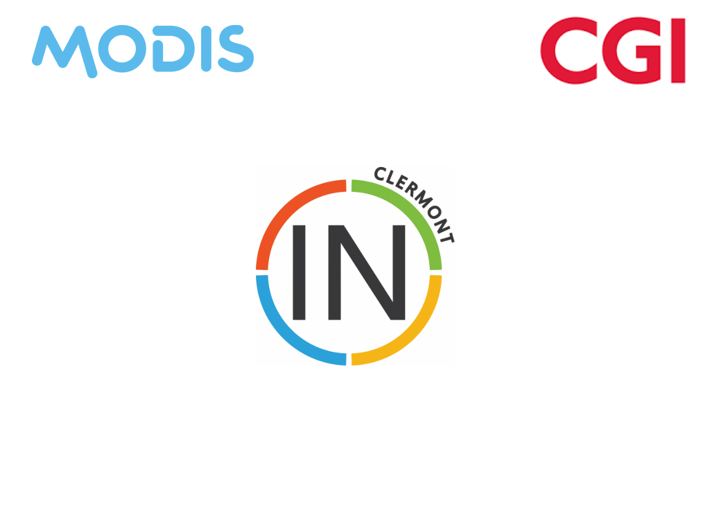

---

# A Story 
## of containers

Note: 
Présentation Mug / Sujet (Damien - 5min)

---

## Physical Deployment

Note: 
Déploiement Physique (Damien - 5min)

---

## Virtualization

Note:  
Virtualisation (Jérôme ou Pierre - 5min)

+++

### Virtualization - What is it ?

+++

### Virtualization - Cons

---

## Containers

Note: 
Containers (Jérôme ou Pierre - 20min)

+++

### Containers - What is it ?

+++

### Demo 

Note: 
    -> DockerFile
    -> Apache avec files

+++

### Docker Hub / Registry

---

## Orchestrator

+++

### Orchestrator - What is it ?

* Cluster Management

+++

### Orchestrator - What is it ?

Core capabilities: 
* Cluster Management
    * Host discovery
    * Host Health Monitoring

Note: 
C'est tout le coeur de l'orchestration : Distribuer les services/application sur plusieurs hosts pour améliorer la performance, la disponibilité et la reprise d'activité

+++

### Orchestrator - What is it ?

Core capabilities:
* Cluster Management
    * Host discovery
    * Host Health Monitoring
* Scheduling

Note: 
C'est la capacité d'un administrateur à charger un fichier de service sur un système hôte qui établit comment exécuter un conteneur spécifique. 

+++

### Orchestrator - What is it ?

Core capabilities:
* Cluster Management
    * Host discovery
    * Host Health Monitoring
* Scheduling
* Orchestrator Updates and Host Maintenance

Note: 
C'est la capacité de maintenir un cluser à jours et des hosts à jours sans interuption de service.

+++

### Orchestrator - What is it ?

Core capabilities:
* Cluster Management
    * Host discovery
    * Host Health Monitoring
* Scheduling
* Orchestrator Updates and Host Maintenance
* Service Discovery

Note: 
C'est la capacité d'un orchestrateur de faire communiquer des services entre eux en prenant en considération l'aspect changeant de la configuration des services qui sont exécutés à un instant T sur le cluster.

+++

### Orchestrator - What is it ?

Core capabilities:
* Cluster Management
    * Host discovery
    * Host Health Monitoring
* Scheduling
* Orchestrator Updates and Host Maintenance
* Service Discovery
* Networking and Load Balancing

Note: 
Si l'on veut que le ServiceDisovery fonctionne alors que les services sont exécutés avec plusieurs instances par exemple, nous aurons besoins : 
* Load balancing,
* Résolution de noms, 
* ...

+++

### Orchestrator - What is it ?

Core capabilities:
* Cluster Management
    * Host discovery
    * Host Health Monitoring
* Scheduling
* Orchestrator Updates and Host Maintenance
* Service Discovery
* Networking and Load Balancing
* Multi-tenant, Multi-region

Note: 
Multi-tenant: C'est ce qui permet d'utiliser un cluster pour plusieurs besoins/equipes/projets (tenant). 
Multi-region: C'est ce qui permet d'orchestrer des containers dans plusieurs régions du monde en même temps dans un seul cluster.

+++

### Orchestrator - What is it ?

Additional capabilities:
* Application Health Monitoring

Note: 
C'est la capacité d'un cluster de monitorer le fonctionnement des hosts et d'en déduire des actions à effectuer sur le cluster.

+++

### Orchestrator - What is it ?

Additional capabilities:
* Application Health Monitoring
* Application Deployments

Note: 
C'est la capacité d'un cluster d'orchestration de choisir comment une application à partir d'un descripteur de comment est composé une applciation: 

* Sélection des hosts sur lesquels les containers vont être exécutés
* Réaliser la configuragtion des containers

+++

### Orchestrator - What is it ?

Additional capabilities:
* Application Health Monitoring
* Application Deployments
* Application Performance Monitoring

Note:
C'est enfin la capacité de l'orchestrateur de monitorer le fonctionnement de l'application, d'en déduire des actions à effectuer pour que celle-ci continue de fonctionner correctement:

* Augmenter le nombre d'instance (Scaling)
* Déplacer les containers sur d'autres hosts

+++

### Orchestrator - The products

+++

### Orchestrator - The products

Commonly used Orchestrators: 
* Docker Swarm

+++

### Orchestrator - The products

Commonly used Orchestrators: 
* Docker Swarm
* Kubernetes

+++

### Orchestrator - The products

Commonly used Orchestrators: 
* Docker Swarm
* Kubernetes
* Nomad

+++

### Orchestrator - The products

Commonly used Orchestrators: 
* Docker Swarm
* Kubernetes
* Nomad
* Empire

+++

### Orchestrator - The products

Commonly used Orchestrators: 
* Docker Swarm
* Kubernetes
* Nomad
* Empire
* Mesoshpere

+++

### Orchestrator - The products

Commonly used Orchestrators: 
* Docker Swarm
* Kubernetes
* Nomad
* Empire
* Mesoshpere
* Rancher

+++

### Démo (5min)

+++

### And the Cloud ? 

+++

### And the Cloud ? 

* Docker Cloud
    Running with Amazon Web Services (aka: AWS)

+++

### And the Cloud ? 

* Docker Cloud
    Running with Amazon Web Services (aka: AWS)
* Amazon Elastic Container Service (aka: Amazon ECS)

+++

### And the Cloud ? 

* Docker Cloud
    Running with Amazon Web Services (aka: AWS)
* Amazon Elastic Container Service (aka: Amazon ECS)
* Azure Kubernetes Service (aka: AKS)    

---

## Question ?

Note: 15 min