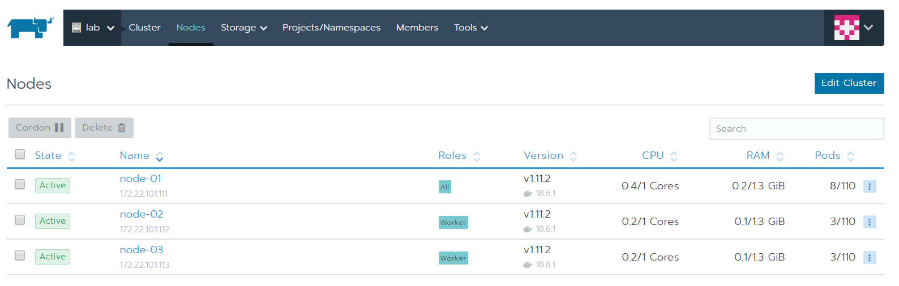

# The Pitch

[](https://gitpitch.com/mug-in-clermont-public/M6-2018/master?grs=gitlab&t=sky)

## The movie

[](http://www.youtube.com/watch?v=4U6XK6NvJ30)

## How to start my cluster

### Prerequisites

#### Software

* Virtual Box
* Vagrant
* Git
* Access to the internet

#### Hardware

* 2 or more CPUs
* 8 Go RAM

### Clone this repository

First of all you'll need to clone this repository:

```bash

git clone https://gitlab.com/mug-in-clermont-public/M6-2018.git
cd M6-2018/demo/orchestrator/

```

### Start the cluster

Once done, take a look at the cluster configuration file **config.yml**

```yml
default_password: admin
version: stable
cluster: 
  name: "lab"
master:
  cpus: 1
  memory: 1500
node:
  count: 3
  cpus: 1
  memory: 1500
ip:
  master: 172.22.101.100
  node:   172.22.101.111
```

#### Use vagrant to deploy the cluster

```sh
vargant up
```

The deployment could take some times, enjoy this moment to take a little coffee before playing

### Access to the rancher UI

If you didn't change anything, browse this website with admin/admin identifiers.

[https://172.22.101.100](https://172.22.101.100)

#### Your cluster will be ready when you will see



### Destroy the cluster

```sh
vagrant destroy -f
```
